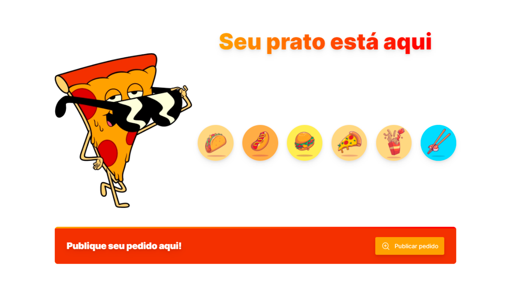
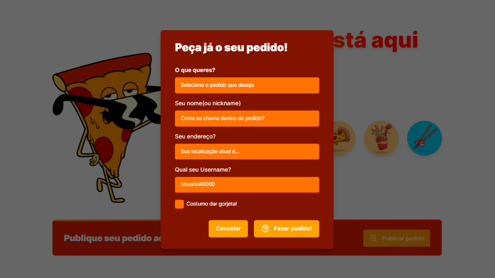
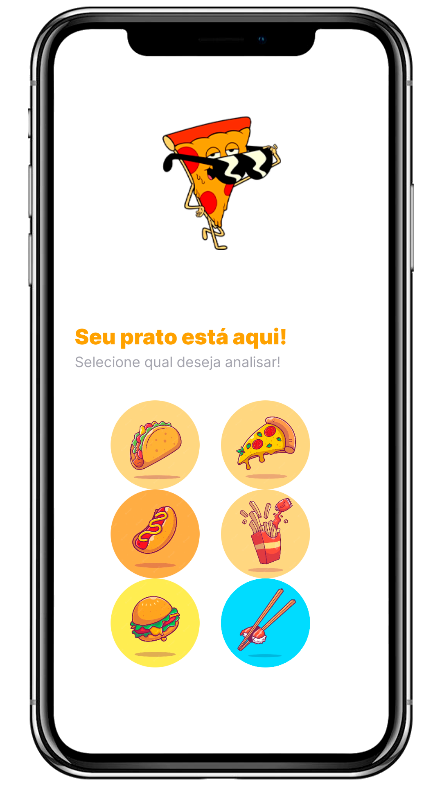
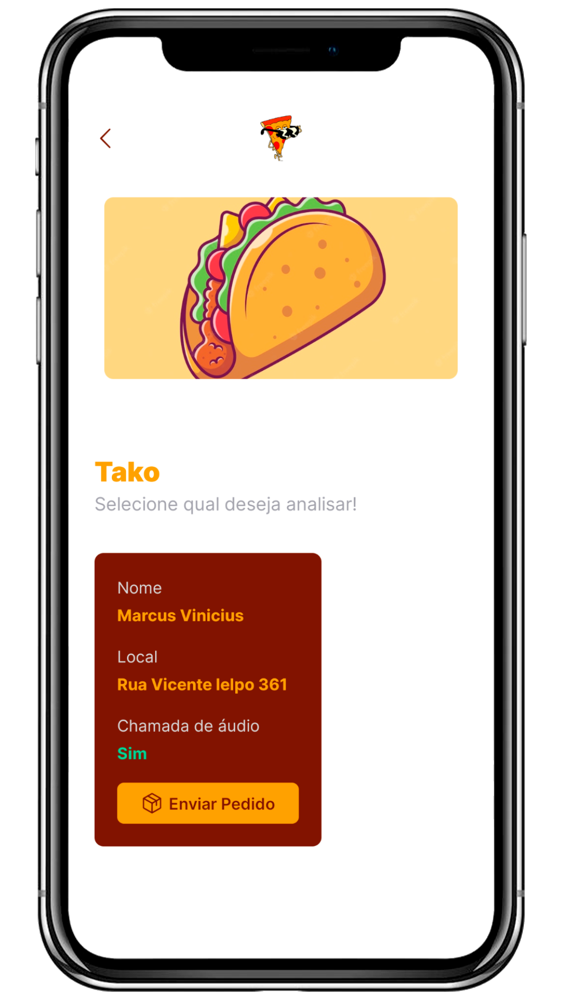
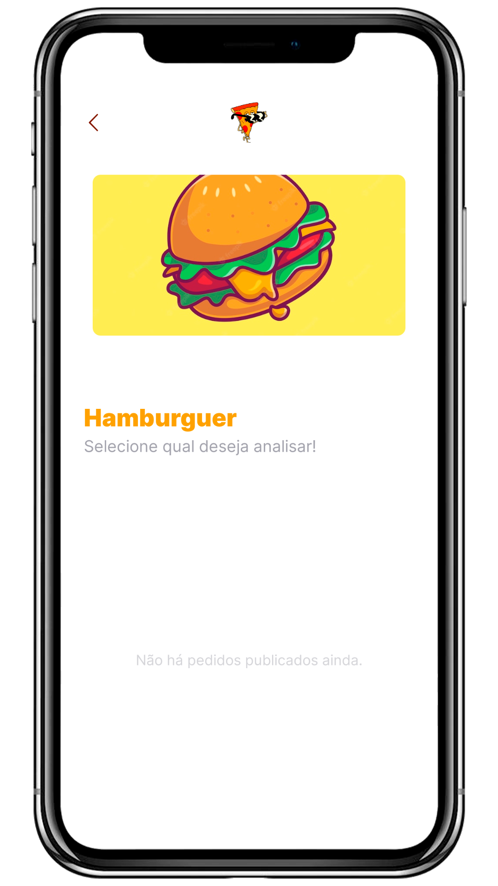

<h1 align="center">Fast Delivery 🍕</h1>

<p align="center">🔥 Faça seu pedido e bom apetite em família! </p>

<p align="center">
 <a href="#-executar">Como executar</a> •
 <a href="#-tecnologias">Tecnologias</a> •
 <a href="#-projeto">Projeto</a> • 
 <a href="#-objetivo">Objetivo</a> • 
  <a href="#-roadmap">Roadmap</a>
</p>

<br />

## 💻 Version Web

<br />

<div id="layout" align="center">
  <p align="stretch">
    
    
  </p>
</div>

## 📲 Version Mobile

<br />

<div align="center" >
    <p align="stretch">
    
    
    
    </p>
</div>

<br  />

## 🚀 Como executar

Clone o repositório e acesse a pasta.

```bash
$ git clone https://github.com/maarcusvinicius/Fast-Delivery.git

Para iniciar o projeto:

# Instalar as dependências
$ npm install / yarn

# Iniciar o projeto
$ npm run / yarn run
```
A aplicação pode ser acessada em [`localhost:5173`](http://localhost:5173).

<br />

## 🚀 Tecnologias

Esse projeto foi desenvolvido com as seguintes tecnologias:

- [React](https://reactjs.org/) / [React Native](https://reactnative.dev/)
- [Vite](https://vitejs.dev/)
- [Expo](https://expo.dev/)
- [TypeScript](https://www.typescriptlang.org/)
- [Prisma](https://www.prisma.io/)
- [Node](https://nodejs.org/)

<br />

## 💻 Projeto

O Fast Delivery é um projeto que simula um aplicativo de delivery online Web, onde é possível criar seu pedido aos inputs e enviá-los ao banco de dados criado com Prisma, para serem renderizados no aplicativo Mobile para a lanchonete atender e enviar seus pedidos!

<br />

## ✅ Objetivo

Me aprofundar mais em Clean Code, React, React Native, Typescript e criação de API com NodeJS para criação de futuros projetos, acessivel e de fácil compreensão!!

<br />

## 🏍️ Roadmap
<br />

    - [x] Criar version Web

    - [x] Criar version Mobile

    - [x] Criar Backend Node

    - [x] Conexão da API criada

    - [ ] Authentication Web

    - [ ] Authentication Mobile

    - [ ] Deploy

<br />

<h4 align="center"> 
	🚧  Fast Delivery 🍕 EM CONSTRUÇÃO...  🚧
</h4>
<br />

<br />

Feito com ❤️ por Marcus Vinicius 👋🏽 Entre em contato!


//feito readme marcus 


### Olá, sou Marcus 

Sou Desenvolvedor Web, um programador procurando fazer a diferença no mundo digital. [**Profile Github**](https://github.com/maarcusvinicius). 🚀

#### Minhas ferramentas atuais
📲 Front-end Mobile com React Native  
🌎 Front-end Web com Reactjs  
📡 Back-end com Nodejs  
🛠️ Typescript  
🧰 And more...  


#### 💬 Encontre-me em outro lugar

[](https://www.linkedin.com/in/marcus-vinicius-507718228/)
[](marcus.editor77@gmail.com)
